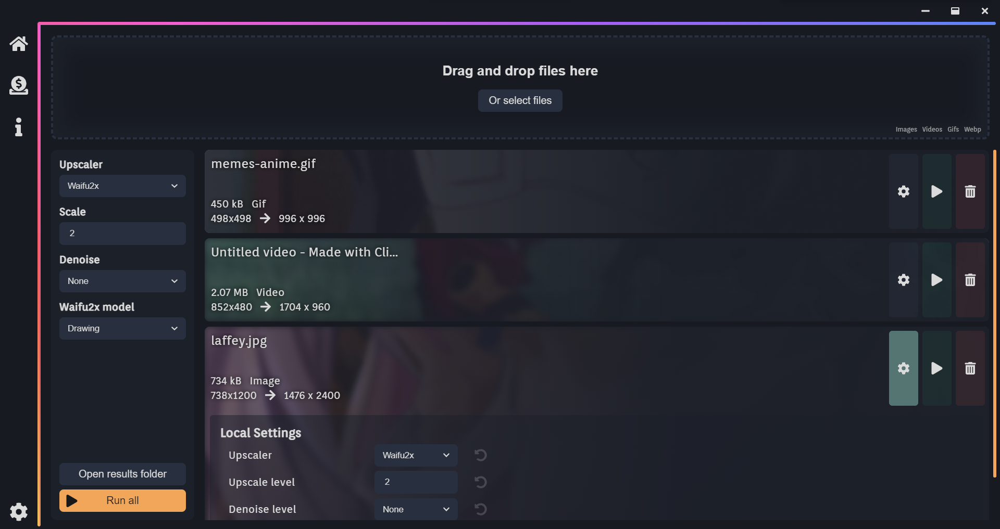

# Scapix - A denoiser app
Scapix is an app developed with sveltekit, electron, waifu2x and esrgan.
It's made to denoise/upscale images, gifs, videos locally on your computer.

# Installation

## Windows 
Simply download the latest release from the [releases page](https://github.com/Specy/Scapix/releases/latest), download the installer and run it.

## Other OS
Currently the app is not pre bundled for other OSses but it should be possible to compile it manually, this will take +-10 minutes, look for the [building section](#building) for more info.

# Usage
Once ran the app, you can import images to upload, set the different options and click on the `run all` button to upscale all the images at once, or individually on each image by pressing the play button.

You can apply global settings that will be used as the default if specific ones aren't set, but you can also override those in each image individually.

For more info, check the info page in the app.

# Donate

If you like this app and the work i do, please consider donating to support the development, through [ko-fi](https://ko-fi.com/specy) or [paypal](https://paypal.me/specyDev)

# Building
Once cloned the repo, install the dependencies with `npm installDeps` command, this will install the dependencies for both electron and the client

Afterwards, you can run `npm run build` or `npm run build:debug` to build the app, the debug version will show some additional logs in the console.

# Local development
To run the app locally in dev mode, install the dependencies with `npm installDeps` and in one terminal run `npm run dev:electron` and in another `npm run dev:client` to start the electron app and the client respectively. Whenever you make changes to the electron, you must restart the server (to improve). The client will hot reload on changes.

# Credits 

[Waifu2x module](https://github.com/Tenpi/waifu2x)
[Waifu2x Models](https://github.com/nagadomi/waifu2x)
[ffmpeg](https://github.com/FFmpeg/FFmpeg) 